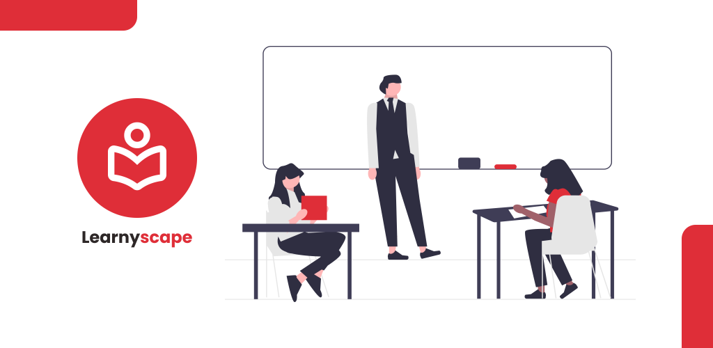
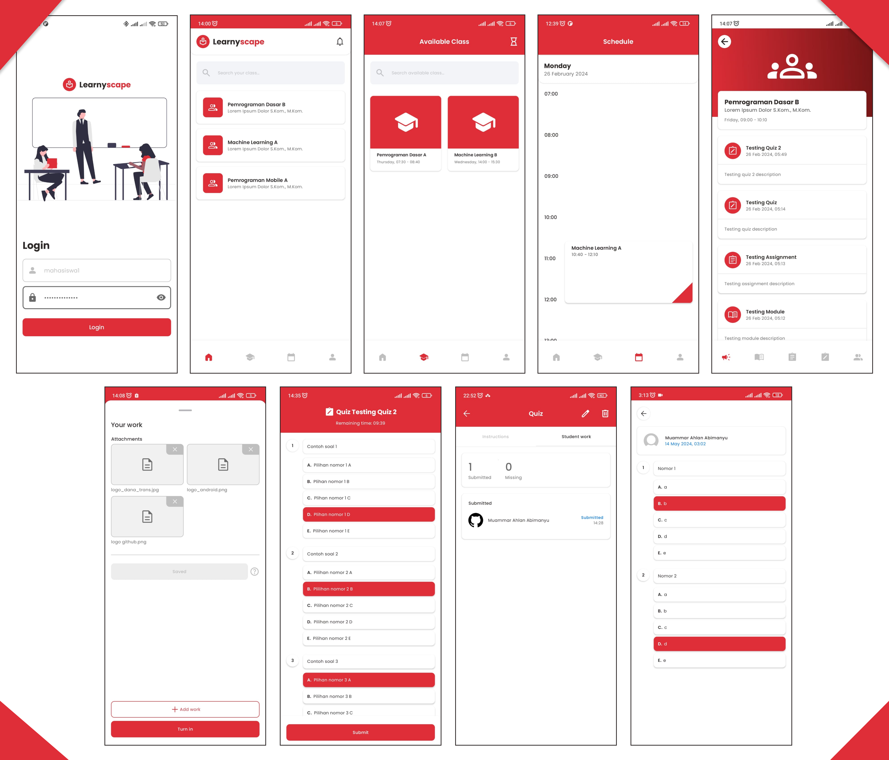

Learnyscape
==================
**Learnyscape** is a Learning Management System (LMS) Android app. It's intended for my Bachelor thesis project.
I made it all by myself with determination and full of my heart.
It follows Android design and development best practices.

# Features
**Learnyscape** has two type of users, Lecturer and Student, and both of them have similar features.
We can't create an account here, only admin (via internal website) can do that, because this app is intended 
for educational institutions. Lecturers can manage their classes like create an announcement for the class, 
create a learning materials, create an assignments and check the submissions, and create a quizzes and check
the submissions also. On the other hand, Students can access the their enrolled classes like access 
a learning materials, and submit their assignments or quizzes work. Last but not least, users can see
their schedule for today.

### Screenshots

# Stacks
- Using fully [Jetpack Compose](https://developer.android.com/jetpack/compose) to create UI and [Navigation Component](https://developer.android.com/develop/ui/compose/navigation) to handle navigation between screens
- Using [Modularization](https://developer.android.com/topic/modularization) and [Version Catalogs](https://developer.android.com/build/migrate-to-catalogs) to handle multi-modules
- Using [Clean Architecture](https://developer.android.com/topic/architecture) and [MVI](https://proandroiddev.com/migrate-from-mvvm-to-mvi-f938c27c214f) architecture pattern
- Using [Retrofit](https://square.github.io/retrofit/) and [Kotlin Serialization](https://kotlinlang.org/docs/serialization.html#serialize-and-deserialize-json) to handle network data
- Using [DataStore](https://developer.android.com/topic/libraries/architecture/datastore) for local data
- Using [Hilt](https://developer.android.com/training/dependency-injection/hilt-android) for DI
- Using [Kotlin Flow](https://developer.android.com/kotlin/flow) for reactive programming
- Using [Firebase Cloud Messaging (FCM)](https://firebase.google.com/docs/cloud-messaging) for push notifications
- Implemented [unit test](https://developer.android.com/training/testing/local-tests) and [Compose UI test](https://developer.android.com/develop/ui/compose/testing)

# How to run
### ⚠️Currently you can't run the app due to expired backend server
**Learnyscape** uses internal server so you can't build and run it.
But you can try it by download the app-debug.apk file in [releases](https://github.com/muammarahlnn/Learnyscape/releases/tag/v1.1.1) 
(100% guaranteed safe, not like wedding invitation apk). And login with these accounts:
- Lecturer Username: test-dosen Password: test
- Student Username: test-mahasiswa Password: test

Note: Please don't change the password :)

# License
**Learnyscape** is distributed under the terms of the Apache License (Version 2.0)
See the [license](LICENSE) for more information.
